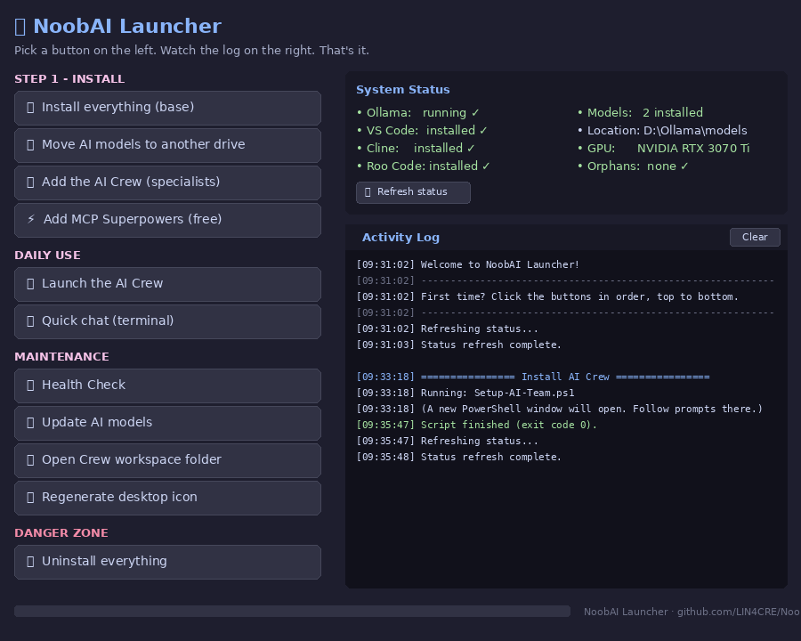

# 🤖 NoobAiSetup

**A one-click local AI assistant for Windows 11 — built for noobs, by a noob, with the help of an AI.**

Turns your gaming PC into a private, offline AI workstation with a **multi-agent crew** (Foreman + specialist workers) that can read/write files, run commands, update Windows, sort folders, write code, search the web, remember things, and more.

> 💰 **100% free. No accounts. No API keys. No subscriptions.** Everything runs locally on your hardware.

---

## 🎛️ One-click GUI launcher

The easiest way to use this toolkit is the GUI:

> **Double-click `LAUNCHER.bat`** — that's it.

You get a friendly window with big buttons, live status lights, and an activity log. No PowerShell. No command line. No decisions to make beyond clicking the next button down the list.

Prefer the manual route? Every `*-Run-Me.bat` file still works standalone.

---

## ✨ Features

- 🧠 **Local AI** — Qwen3-Coder runs on your GPU via [Ollama](https://ollama.com). Nothing leaves your PC.
- 👷 **Multi-agent crew** — A Foreman delegates to specialists (Sysadmin, Coder, Librarian, Researcher, Inspector).
- 🛡️ **Safety-first** — Every command is shown before running. Read-only Inspector mode for diagnosis. Librarian always dry-runs first.
- 🚚 **Solves the "moving models breaks everything" headache** — One script fixes `OLLAMA_MODELS` properly so models stay where you put them.
- 🔌 **8 free MCP superpowers** — Web search, web fetching, long-term memory, sequential reasoning, Git, SQLite, time, fast filesystem.
- 🧹 **Clean uninstaller** — Finds and removes every orphan model folder across all your drives.
- 🩺 **Health Check** — One click shows you exactly what's installed, what's broken, and where your models actually live.
- 🎛️ **GUI launcher** — Big buttons, live status, activity log. No command line needed.
- 🎨 **Friendly desktop icon** — Procedurally generated, no external image needed.

*Run `MAKE-ICON-Run-Me.bat` and this little robot lands on your desktop.*

---

## 💻 Recommended specs

Built and tested on:

| Component | Spec |
|---|---|
| GPU | NVIDIA RTX 3070 Ti (8 GB VRAM) |
| CPU | Intel i7-11700K |
| RAM | 64 GB |
| OS | Windows 11 Pro 25H2 |

Should work on anything with **≥ 6 GB VRAM** and **≥ 16 GB RAM**. Less VRAM? Swap `qwen3-coder:14b` for `qwen3:8b` in the scripts.

---

## 🚀 Quick start

1. **Download the repo** — click the green **Code** button → **Download ZIP** → extract somewhere easy like your Desktop.
2. **Double-click `MAKE-ICON-Run-Me.bat`** — generates a friendly robot shortcut on your desktop.
3. **Double-click the new 🤖 NoobAI icon** on your desktop.
4. Click **Yes** on the UAC (Admin) prompt.
5. In the launcher window, click the buttons **top to bottom**:

   1. 📦 Install everything (base) — *~15–30 min, big download*
   2. 🚚 Move AI models to another drive — *optional but recommended*
   3. 👷 Add the AI Crew (specialists)
   4. ⚡ Add MCP Superpowers (free)

6. Click 🚀 **Launch the AI Crew** to start chatting. 🎉

The status panel updates after every step so you can always see what's installed and what's not.

### Quick start without the GUI

Prefer to skip the launcher? Double-click the `.bat` files in order:

| # | Double-click | What it does |
|---|---|---|
| 1 | `START-HERE-Run-Me.bat` | Installs Ollama, VS Code, Git, Cline, and the AI model |
| 2 | `MOVE-MODELS-Run-Me.bat` | *(Optional)* Move models off C: to another drive properly |
| 3 | `SETUP-CREW-Run-Me.bat` | Installs Roo Code + the 6-agent crew |
| 4 | `SETUP-SUPERPOWERS-Run-Me.bat` | Adds 8 free MCP superpowers |
| 5 | `HEALTH-CHECK-Run-Me.bat` | Confirms everything is green ✅ |

---

## 👥 Meet the crew

Once installed, open VS Code via the desktop shortcut, click the **Roo Code** (kangaroo) icon in the sidebar, and pick a mode:

| Mode | Specialist | Use for |
|---|---|---|
| 👷 **Foreman** | Manager | **Always start here.** Reads your request, delegates to the right worker. |
| 🛠️ **Sysadmin** | Windows expert | Updates, installs, PATH, env vars, services |
| 💻 **Coder** | Programmer | Writes, builds, debugs code |
| 📚 **Librarian** | File organiser | Sorts, renames, dedupes — *always dry-runs first* |
| 🔍 **Researcher** | Planner | Reads docs, compares options (read + markdown only) |
| 🔎 **Inspector** | Auditor | Diagnoses problems — **hardcoded read-only**, can't break anything |

### Example requests for the Foreman

> *"My PC feels slow. Sort it out."*
> → Inspector audits → Foreman shows plan → Sysadmin disables startup junk, runs updates, cleans disk.

> *"My Downloads folder is a mess."*
> → Librarian dry-runs sorting it by file type → you approve → it moves them and logs every action.

> *"Build me a Python script that backs up my Documents to D: every night."*
> → Researcher plans → Coder writes & tests → Sysadmin registers a scheduled task.

> *"Why won't `node` run from PowerShell?"*
> → Inspector reads your PATH → reports findings → Sysadmin fixes it.

---

## 🔌 The 8 free superpowers (MCP servers)

After running the Superpowers step, every specialist gains these abilities:

| Superpower | What it does |
|---|---|
| **filesystem** | Fast, safe file ops across only the folders you whitelist |
| **fetch** | Grab any web page as clean text |
| **duckduckgo** | Web search — no API key, no account |
| **git** | Full git operations (status, diff, log, commit, etc.) |
| **memory** | Long-term memory across chats (knowledge graph in `AI-Crew/memory.json`) |
| **sequential-thinking** | Forces step-by-step reasoning — makes the small model behave much smarter |
| **time** | Current time, date math, timezone conversion |
| **sqlite** | Build/query local databases |

All are open-source, no keys, no accounts. The cheat sheet on your desktop lists what each does.

---

## 📁 File reference

| File | Type | Purpose |
|---|---|---|
| `LAUNCHER.bat` | **GUI front door** | **Start here.** Opens the friendly window. |
| `NoobAI-Launcher.ps1` | GUI engine | The WPF window logic (called by `LAUNCHER.bat`) |
| `MAKE-ICON-Run-Me.bat` | Launcher | Calls `Make-Icon.ps1` |
| `Make-Icon.ps1` | Worker | Generates `NoobAI.ico` + creates desktop shortcut |
| `START-HERE-Run-Me.bat` | Launcher | Calls `Setup-LocalAI.ps1` |
| `Setup-LocalAI.ps1` | Worker | Base install: Ollama, VS Code, Git, Cline, model |
| `MOVE-MODELS-Run-Me.bat` | Launcher | Calls `Move-AI-Models.ps1` |
| `Move-AI-Models.ps1` | Worker | Moves models to another drive + sets `OLLAMA_MODELS` |
| `SETUP-CREW-Run-Me.bat` | Launcher | Calls `Setup-AI-Team.ps1` |
| `Setup-AI-Team.ps1` | Worker | Installs Roo Code + defines the 6-agent crew |
| `SETUP-SUPERPOWERS-Run-Me.bat` | Launcher | Calls `Setup-MCP-Superpowers.ps1` |
| `Setup-MCP-Superpowers.ps1` | Worker | Installs Node.js, uv, and 8 MCP servers |
| `HEALTH-CHECK-Run-Me.bat` | Launcher | Calls `Health-Check.ps1` |
| `Health-Check.ps1` | Worker | Read-only diagnosis: installs, env vars, model locations, GPU |
| `UNINSTALL-Run-Me.bat` | Launcher | Calls `Uninstall-LocalAI.ps1` |
| `Uninstall-LocalAI.ps1` | Worker | Step-by-step removal (every step opt-in) |
| `CHANGELOG.md` | Doc | Version history |
| `LICENSE` | Doc | MIT licence |

Every `.ps1` script has a header with version + repo URL. The `.bat` files are friendly launchers — all the real work is in the matching `.ps1` files. Open any of them in Notepad to see exactly what they do.

---

## 🚚 The "moved models" problem (and the fix)

If you've ever moved your Ollama models from C: to another drive and then everything broke or got duplicated, here's why:

> Ollama only checks **one** environment variable (`OLLAMA_MODELS`) to find your models. If you move the folder but don't update that variable, Ollama silently falls back to the default location on C: and **re-downloads everything**, leaving orphan duplicates eating your disk.

The 🚚 button (or `MOVE-MODELS-Run-Me.bat`) fixes this:

1. Scans every drive for stray model folders (finds your duplicates!)
2. Lets you pick the real one and the destination drive
3. Uses `robocopy` to safely copy with verification
4. Sets `OLLAMA_MODELS` system-wide (Machine scope, permanent)
5. Restarts Ollama and runs `ollama list` so you see proof it works

The 🩺 Health Check shows you orphan folders any time.

---

## 🩺 Troubleshooting

| Problem | Try this |
|---|---|
| `winget` not found | Install **App Installer** from the Microsoft Store, reboot, retry. |
| Scripts won't run / "execution policy" error | Use `LAUNCHER.bat` or any `*-Run-Me.bat` — never run `.ps1` directly. |
| VS Code 'code' command not found | Open VS Code once manually, then re-run the script. |
| Model download stuck | Press Ctrl+C, click 🔄 **Update AI models** in the launcher. |
| Roo Code doesn't see MCP servers | Close & reopen VS Code. First-time server fetch takes 5–30 seconds. |
| "Out of VRAM" errors | Edit the scripts to use `qwen3:8b` instead of `qwen3-coder:14b`. |
| GUI launcher won't open | Make sure all the `.ps1` files are in the same folder as `LAUNCHER.bat`. |
| Something else broken | Click 🩺 **Health Check** in the launcher — it shows you exactly what's wrong. |

---

## 🧰 What gets installed (all free, all open-source)

| Tool | Purpose | License |
|---|---|---|
| [Ollama](https://ollama.com) | Runs LLMs locally | MIT |
| [VS Code](https://code.visualstudio.com) | The editor/chat host | MIT |
| [Git](https://git-scm.com) | Version control | GPL v2 |
| [Cline](https://github.com/cline/cline) | AI agent extension | Apache 2.0 |
| [Roo Code](https://github.com/RooCodeInc/Roo-Code) | Multi-agent extension | Apache 2.0 |
| [Node.js](https://nodejs.org) | Runs MCP servers | MIT |
| [uv](https://github.com/astral-sh/uv) | Runs Python MCP servers | MIT/Apache 2.0 |
| [Qwen3-Coder](https://ollama.com/library/qwen3-coder) | The AI brain | Apache 2.0 |
| 8 [MCP servers](https://github.com/modelcontextprotocol/servers) | Superpowers | MIT |
| [Everything](https://www.voidtools.com/) *(optional)* | Instant file search | Freeware |

---

## ⚠️ Honest limitations

- A 14B local model is roughly as smart as **GPT-3.5 / early GPT-4** for code. The MCP superpowers (especially sequential-thinking + memory) close a lot of that gap, but don't expect Claude/GPT-5-level performance.
- Speed is ~15–25 tokens/sec on an RTX 3070 Ti. Snappy enough for real work but not instant.
- The AI **will** occasionally suggest wrong commands. Always read what it shows you before approving. The Inspector mode is hardcoded read-only — use it when in doubt.
- This is built for **Windows 11**. Probably works on Windows 10 but untested.

---

## 🛡️ Safety notes

- Every PowerShell script **self-elevates** to Administrator (you'll see a UAC prompt).
- Every script is **idempotent** — safe to re-run; skips anything already installed.
- The Uninstaller asks **Y/N for every destructive step**; default is No.
- The Inspector specialist **cannot** run write/install/delete commands — enforced by the extension, not just trust.
- The Librarian specialist **always dry-runs first** and logs every action for undo.
- Nothing phones home. Read the scripts yourself — they're plain text.

---

## 🙏 Credits

- AI scaffolding & scripts: built with the help of [Arena.ai's Agent Mode](https://arena.ai)
- Multi-agent pattern inspired by [Cline](https://github.com/cline/cline) and [Roo Code](https://github.com/RooCodeInc/Roo-Code)
- All the open-source projects listed in the "What gets installed" table — the real heroes
- Colour palette: [Catppuccin Mocha](https://github.com/catppuccin/catppuccin)

---

## 📜 License

MIT — do whatever you want with it. No warranty. If it breaks your PC, you get to keep both pieces. 😅

---

## ⭐ If this helped you

Drop a star on the repo. It's free and tells me to keep maintaining it.
